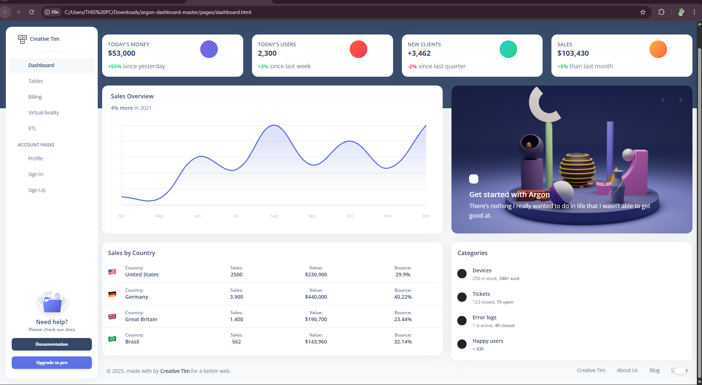
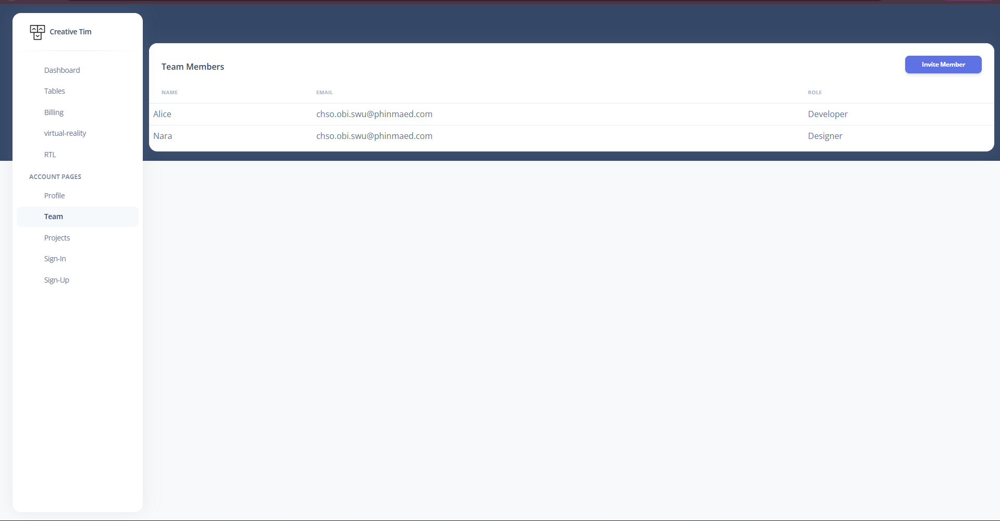
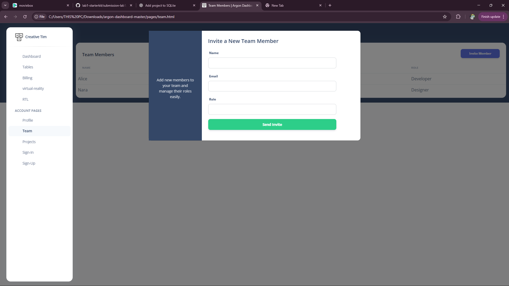
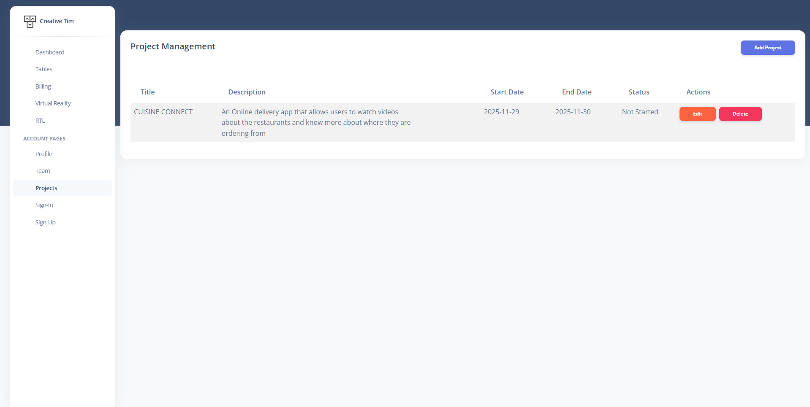
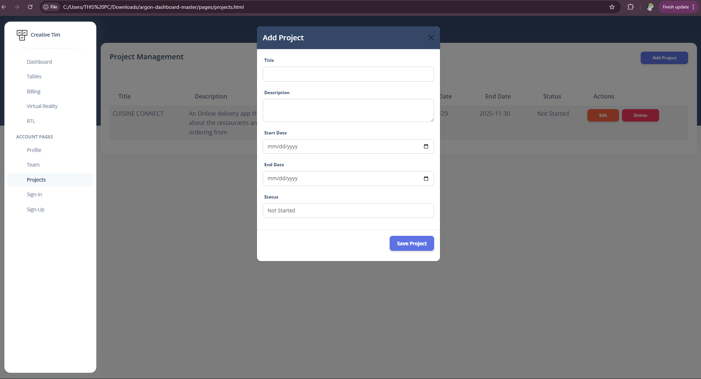
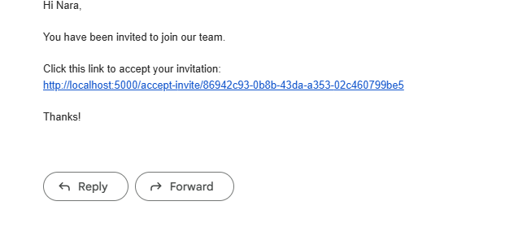

# Lab 1 - Task 2

## Starter Kit Setup

**Starter Kit Used:** Argon Dashboard HTML  
**Source:** [https://www.creative-tim.com/product/argon-dashboard](https://www.creative-tim.com/product/argon-dashboard)

### Steps to Run Locally
1. Download or clone the starter kit.
2. Open the project folder in your file explorer.
3. Open `dashboard.html` with your preferred browser (Chrome, Firefox, Edge, etc.).
4. You should see the dashboard running on your local machine.

### Screenshot of Starter Kit Running Locally

#### Screenshot 1

#### Screenshot 2

#### Screenshot 3

#### Screenshot 4

#### Screenshot 5

---

## Deliverable 2: GitHub Repository Link
My GitHub Repository for this lab:  
[https://github.com/Naraobi/lab1-starterkit](https://github.com/Naraobi/lab1-starterkit)

---

## Setup Instructions for Evaluator
- No additional software or dependencies are required.
- Open `dashboard.html` in a browser to view the dashboard.
- All files needed are included in the repository.

---

## requirements.txt
Not required — this is a static HTML/CSS/JS project.
